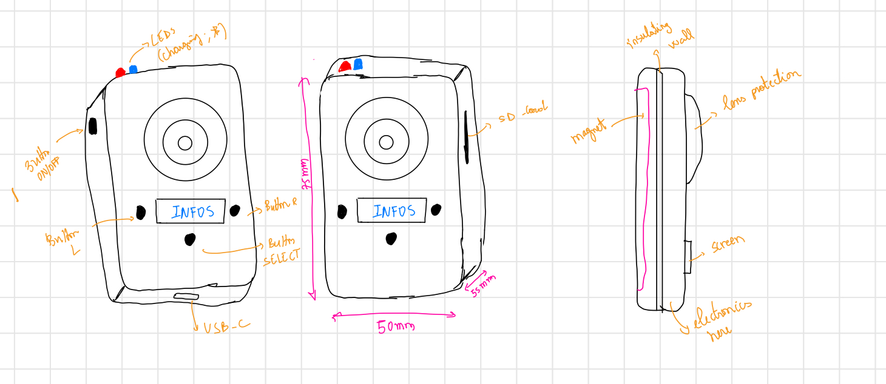
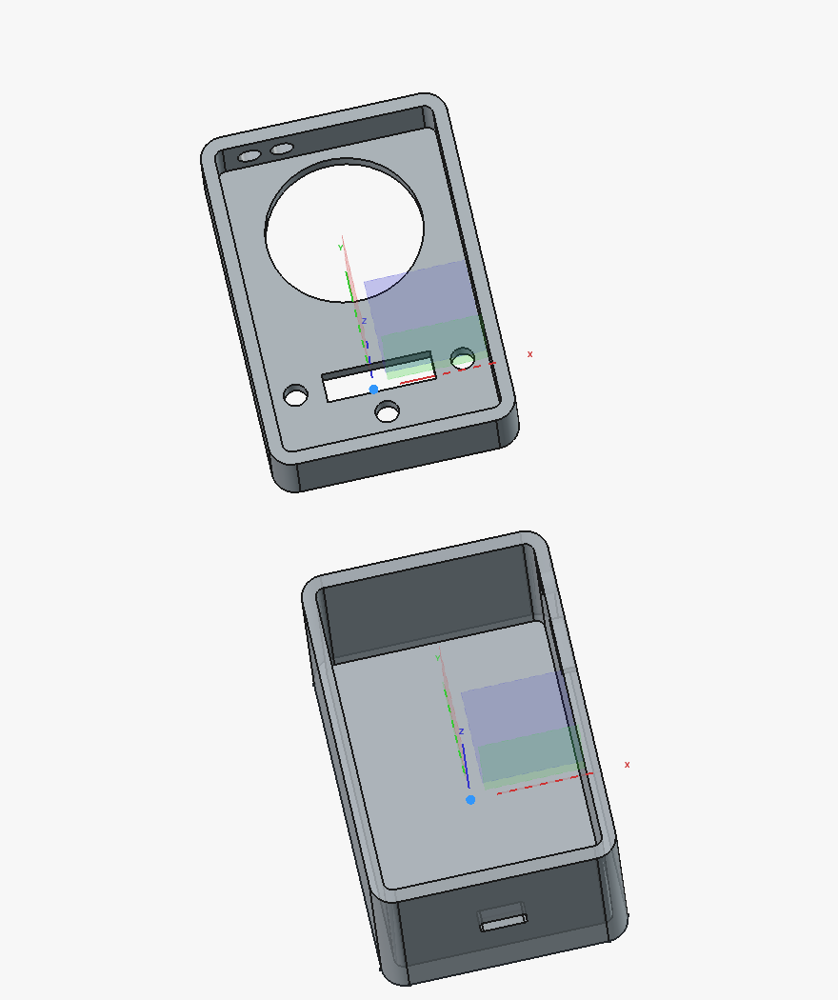
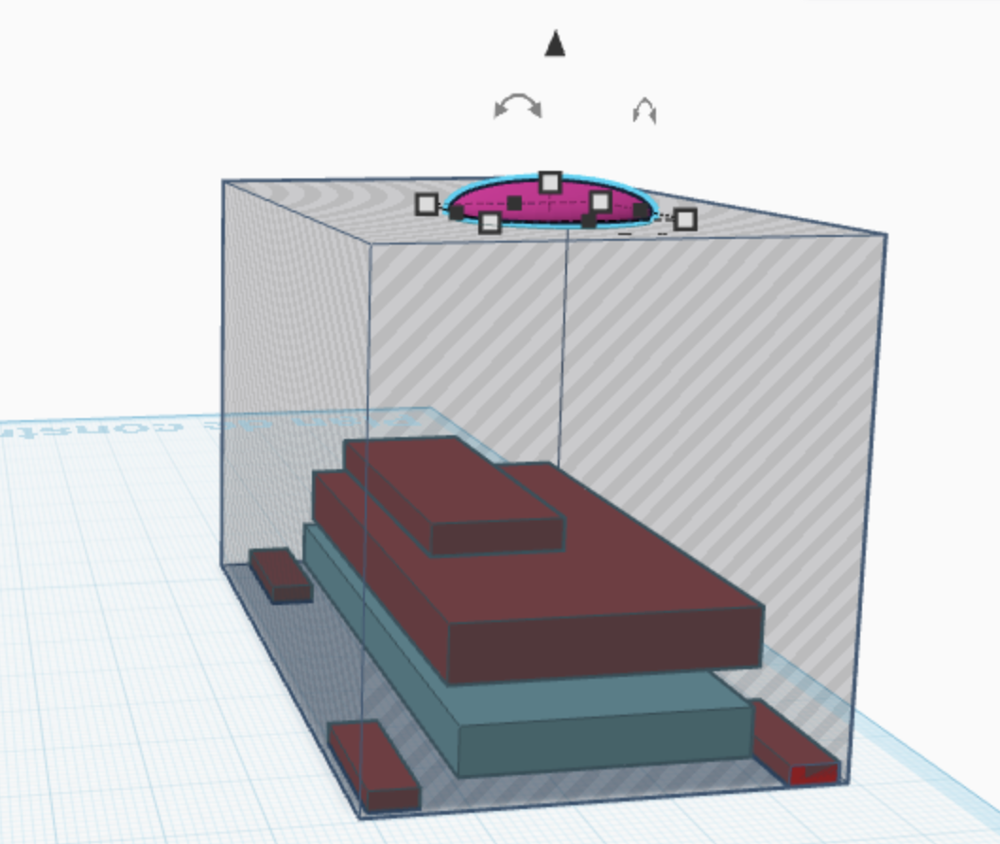

# My POV Camera

I needed a little camera in first-person view for my flights in multi-axes.
So I decided to do it myself. 
It's expensive but fun to do.
Cost: ~ 160 euros (139,25 euros for electronics and 21,14 euros for printing)

My inspos : Osmo Nano ; POV Pro

### Materials 
Here the materials i bought for this project. 
# Hardware Components
# Core Electronics

| Component | Model | Specs | Qty |
|-----------|-------|-------|-----|
| Microcontroller | Raspberry Pi Zero W | 1GHz, 512MB, BT 4.1, WiFi | 1 |
| Camera | IMX219 8MP CSI | 77/130/200°, FFC 15cm | 1 |
| Storage | MicroSD U3 V30 | 128GB, Class 10 | 1 |
| Display | SSD1306 OLED | 0.91", 128×32px, I2C | 1 |

# Power

| Component | Model | Specs | Qty |
|-----------|-------|-------|-----|
| Battery | LiPo 603255 | 3.7V, 1500mAh | 1 |
| Charge module | TP4056 | USB-C, 3.7V, PH2.0 | 1 |

# Connectors & Cables

| Component | Specs | Qty |
|-----------|-------|-----|
| JST PH 1.25 | 2 pins, 100mm, M/F | 20 pairs |
| FPC/FFC ribbon | 0.5mm pitch, type A | 10x (mixed pins) |

# Interface

| Component | Specs | Qty |
|-----------|-------|-----|
| Buttons | Tactile Ø5mm | 3 |
| LED blue | 3mm (Bluetooth) | 1 |
| LED red | 3mm (Battery) | 1 |
| Resistors | 220Ω, 330Ω, 10kΩ | kit |
| Capacitors | 470µF | kit |

# Enclosure & Mounting

| Component | Model | Specs | Qty |
|-----------|-------|-------|-----|
| Dome lens | Acrylic watch crystal | Ø32.5mm, convex | 1 |
| Magnets | N52 neodymium | 15×5×2mm | 5 |
| Epoxy glue | 3M Scotch-Weld DP460 | structural | 1 |
| Enclosure | Custom 3D print | 75×50×55mm, PLA, 20% infill | 1 |

# Tools

| Component | Specs |
|-----------|-------|
| Soldering iron | USB-C, 260–420°C |
| Solder wire | Sn99.3 Cu0.7, 0.8mm, lead-free |
| Multimeter | XL830L |
| Thermal paste | HY410 silicone |
| Arduino UNO R3 kit | breadboard, cables, components for testing|

# Others

| Component | Qty |
|-----------|-------|
| Nylon Necklace | 1 |
|Plastic support for magnet | 1 |

### Design 
I used FreeCAD for my 3D design. 2 parts, a box and a cover.
Here's the idea.

And here's the 3D design on FreeCAD.

I used TinkerCAD too for a quick prototype, to ensure that everything could fit in the 3D design.

