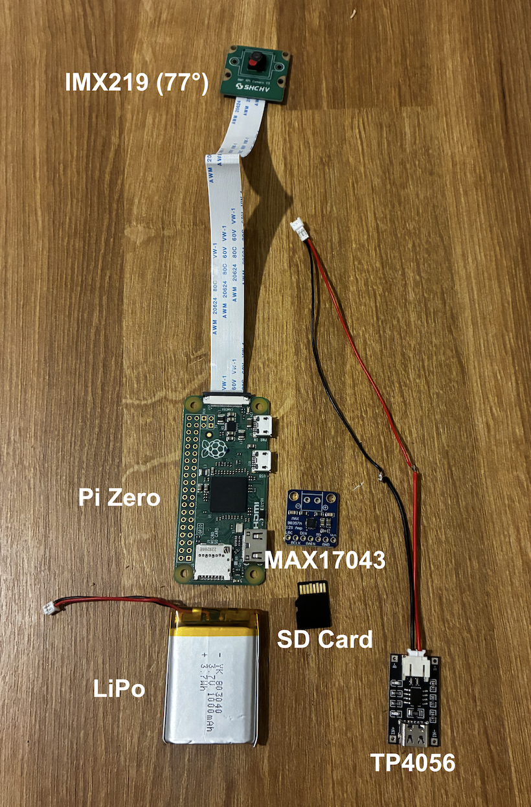
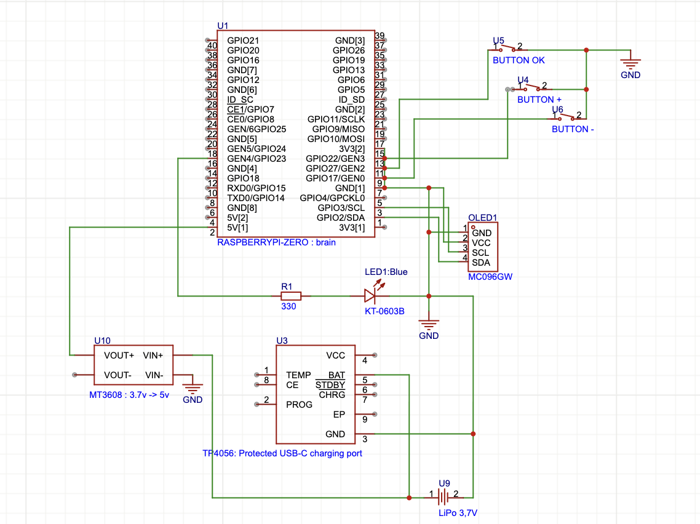

# [ ◉¯] My POV Camera

A tiny, magnet-mounted camera that clips onto any metal surface to film my ULM flights (multi-axis) in 1080p.
---

## ✦ The Idea

A small first-person-view camera that:

- sticks to any magnetic surface (N52 magnets on the back)
- records my multi-axis flights in 1080p
- stays minimalist, with little engraved drawings on the 3D shell

---

## ✦ Hardware

### Core Electronics
| Component | Model | Specs | Qty |
|---|---|---|---|
| Microcontroller | Raspberry Pi Zero 1.3 | 1 GHz single-core, 512 MB, **no WiFi / no BT** | 1 |
| Camera | IMX219 8MP CSI | 77° lens variant, mini CSI FFC | 1 |
| Storage | MicroSD U3 V30 | 128 GB, Class 10 | 1 |

> The Pi Zero 1.3 has no wireless. Video is offloaded by pulling the microSD card and reading it on a computer.

### Power

| Component | Model | Specs | Qty |
|---|---|---|---|
| Battery | LiPo 603255 | 3.7 V, ~1500 mAh (≈6.0×32×55 mm) | 1 |
| Charge module | TP4056 | USB-C, protected, JST PH2.0 | 1 |
| Boost converter | MT3608 | 3.7 V → 5.1 V (powers the Pi) | 1 |

> **Power path:** TP4056 charges the LiPo over USB-C → on a protected TP4056 the load draws from **OUT+** (not BAT) → MT3608 boosts to **~5.1 V** (pre-adjusted *before* connecting the Pi) → feeds the Pi 5 V.

### Interface
| Component | Pin / Specs | Notes | Qty |
|---|---|---|---|
| Power button | **GPIO3 (pin 5)** | hardware boot-from-halt on press; software clean shutdown when pressed while running | 1 |
| Play/Stop button | free GPIO → GND, internal pull-up | start / stop recording | 1 |
| LED (REC) | green 3 mm, via resistor | recording status | 1 |
| Resistors / passives | 220 Ω, 330 Ω, 10 kΩ · 470 µF | — | kit |

### Enclosure & Mounting
| Component | Model | Specs | Qty |
|---|---|---|---|
| Standoffs / screws | brass | **M2.5** | set |
| Dome lens | acrylic watch crystal | Ø32.5 mm, convex | 1 |
| Magnets | N52 neodymium | 15×5×2 mm | 5 |
| Epoxy glue | 3M Scotch-Weld DP460 | structural | 1 |
| Enclosure | custom 3D print | ≈68×36×28.4 mm, PLA, 20 % infill | 1 |

### Tools
| Component | Specs |
|---|---|
| Soldering iron | USB-C, 260–420 °C |
| Solder wire | Sn99.3 Cu0.7, 0.8 mm, lead-free |
| Multimeter | XL830L |

---

## ✦ Circuit

---

## ✦ 3D Design

FreeCAD for the design, TinkerCAD for quick fit-checks. The enclosure is a **layered sandwich** held together by M2.5 brass standoffs and screws : three compartmented zones stacked vertically:

- **Top : Interface:** camera, buttons, REC LED
- **Middle : Pi Zero**
- **Bottom : Energy:** a shelf plate separates the **battery** from the **TP4056 + MT3608** modules

> The LiPo eats ~72 % of the floor footprint, so it gets its own level and can't share a layer with the charge/boost modules — hence the shelf plate.

## ✦ Code

| Module | Role |
|---|---|
| `config.py` | pins, paths, settings |
| `camera.py` | wraps **`rpicam-vid`** as a subprocess for hardware H.264 (preferred over picamera2 on the slow ARMv6 Zero 1.3) |
| `inputs.py` | buttons (Play/Stop, Power) |
| `indicators.py` | REC LED |
| `controller.py` | simple **IDLE ↔ RECORDING** state machine |
| `main.py` | entry point, **systemd** autostart |

## ✦ Results

...
